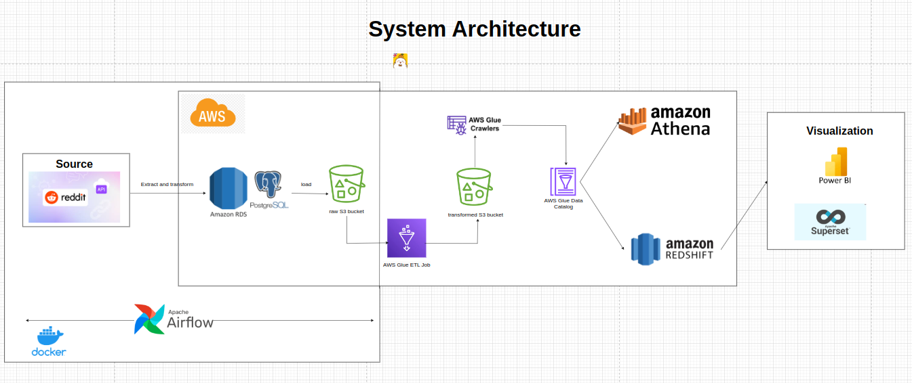

# AWS Data pipeline using Reddit API (Social Platform)

## Table of Contents
- [Introduction](#introduction)
- [Overview](#overview)
- [Architecture](#architecture)
- [Prerequisites](#prerequisites)
- [System Setup](#system-setup)
  
## Introduction
This project provides a comprehensive data pipeline solution to extract, transform, and load (ETL) Reddit data into a Redshift data warehouse.
The pipeline leverages a combination of tools and services including Apache Airflow, Celery, PostgreSQL, Amazon S3, AWS Glue, Amazon Athena, and Amazon Redshift. 

## Overview

The pipeline is designed to:

1. Extract data from Reddit using its API.
2. Transform data and load it into Amazon RDS PostgreSQL database from Airflow.
3. Load data from RDS database into an S3 bucket from Airflow.
4. Transform the data using AWS Glue and Amazon Athena.
5. Load the transformed data into Amazon Redshift for analytics and querying.

## Architecture

